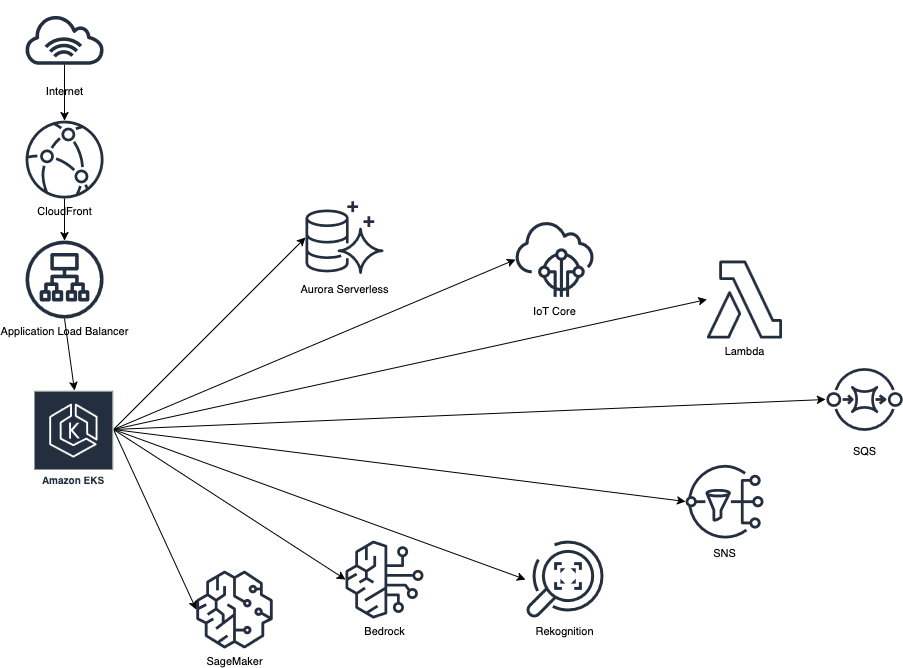
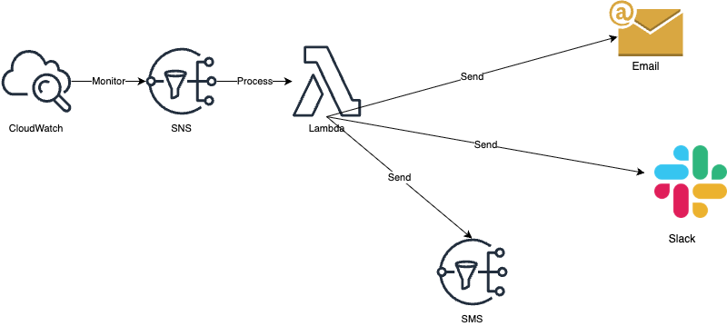
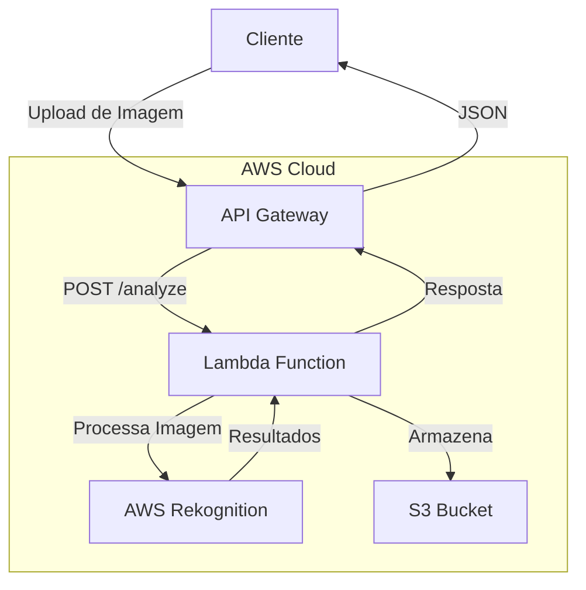
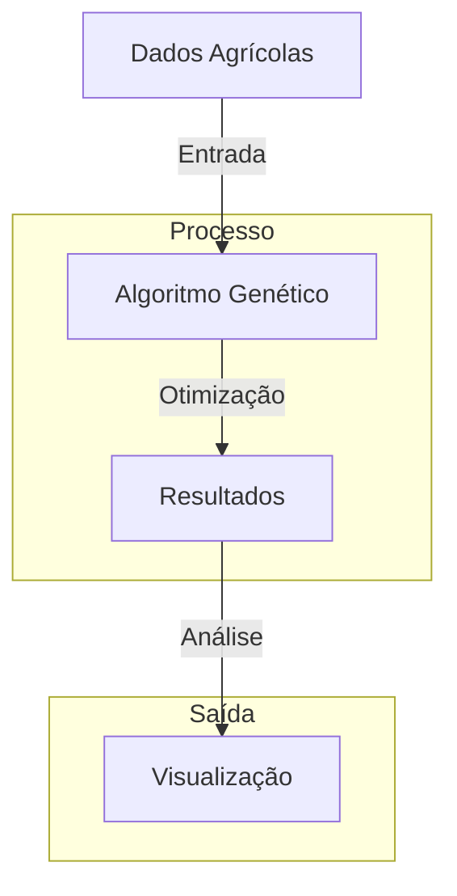
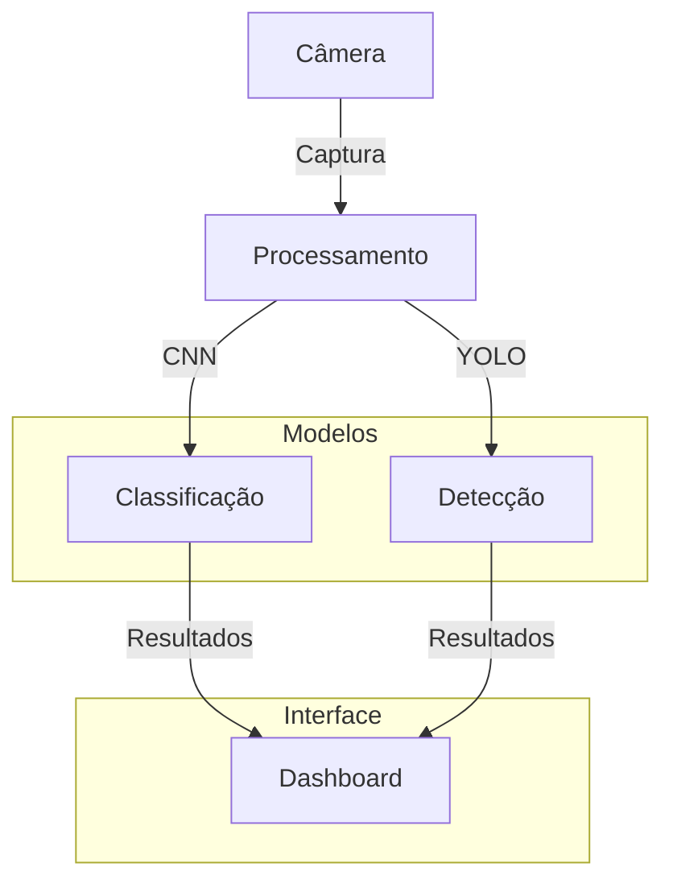

# FarmTech - Sistema Integrado de Gestão para Agronegócio

## Descrição do Projeto
Este projeto integra todas as funcionalidades desenvolvidas nas Fases 1 a 6 em um sistema unificado de gestão para agronegócio, com capacidade de adaptação para outros setores da economia.

## Estrutura do Projeto
```
sources/
├── fase1/          # Fase 1 - Base de Dados Inicial
├── fase2/          # Fase 2 - Banco de Dados Estruturado
├── fase3/          # Fase 3 - IoT e Automação Inteligente
│   ├── cap12/     # Primeiro projeto da Fase 3
│   └── cap1/      # Segundo projeto da Fase 3
├── fase4/          # Fase 4 - Dashboard Interativo
├── fase5/          # Fase 5 - Cloud Computing & Segurança
├── fase6/          # Fase 6 - Visão Computacional
└── dashboard/      # Dashboard Integrado (Fase 7)
```

## Arquitetura

### Diagramas de Arquitetura

#### Topologia Cloud

*Diagrama da infraestrutura AWS do FarmTech Dashboard*

#### Fluxo de Alertas

*Sistema de gerenciamento e distribuição de notificações*

### Componentes Principais

- **Frontend**: Aplicação React com TypeScript, hospedada no CloudFront
- **Backend**: API Gateway com Node.js/Express, rodando em containers no EKS
- **Banco de Dados**: Aurora Serverless (PostgreSQL) para armazenamento de dados
- **IoT**: AWS IoT Core para gerenciamento de dispositivos
- **AI/ML**: SageMaker e Bedrock para análise de dados e previsões
- **Monitoramento**: CloudWatch para logs e métricas
- **Segurança**: IAM, WAF e Shield para proteção

### Infraestrutura como Código (IaC)

#### O que é IaC?
Infraestrutura como Código (IaC) é uma prática que permite gerenciar e provisionar infraestrutura através de código, em vez de processos manuais. No FarmTech, utilizamos Terraform para implementar IaC.

#### Por que usar IaC?
1. **Consistência**: Elimina erros humanos e garante que todos os ambientes sejam idênticos
2. **Versionamento**: Permite rastrear mudanças na infraestrutura como código
3. **Automação**: Reduz tempo de deploy e possibilidade de erros
4. **Reutilização**: Facilita a replicação da infraestrutura em diferentes ambientes
5. **Documentação**: O código serve como documentação viva da infraestrutura

#### O que o IaC resolve no FarmTech?
1. **Gestão de Recursos AWS**:
   - Provisionamento automático de VPC, subnets e security groups
   - Configuração do cluster EKS
   - Gerenciamento de banco de dados Aurora
   - Configuração de serviços serverless (Lambda, API Gateway)

2. **Segurança**:
   - Políticas IAM automatizadas
   - Configuração de WAF
   - Gerenciamento de secrets
   - Controle de acesso granular

3. **Monitoramento**:
   - Configuração do CloudWatch
   - Dashboards automáticos
   - Alertas e métricas
   - Logs centralizados

4. **Escalabilidade**:
   - Auto-scaling groups
   - Load balancers
   - Cache distribuído
   - Banco de dados serverless

## Ir Além

### Opção 1: Integração de IA na Infraestrutura AWS

#### Arquitetura


#### Componentes
- **API Gateway**: Endpoint HTTP para receber requisições
- **Lambda Function**: Processa imagens e integra serviços
- **AWS Rekognition**: Serviço de análise de imagens
- **S3 Bucket**: Armazenamento de imagens
- **CloudWatch**: Monitoramento e logs

### Opção 2: Otimização com Algoritmos Genéticos

#### Arquitetura


#### Componentes
- **Entrada de Dados**: Dados históricos da fazenda
- **Algoritmo Genético**: 
  - Seleção de indivíduos
  - Crossover
  - Mutação
  - Avaliação de fitness
- **Visualização**: Gráficos e métricas

### Opção 3: Sistema de Visão Computacional

#### Arquitetura


#### Componentes
- **Captura**: Sistema de câmeras
- **Processamento**: 
  - CNN para classificação
  - YOLO para detecção
- **Dashboard**: Visualização dos resultados

## Requisitos
- Python 3.8+
- AWS CLI configurado
- Dependências listadas em requirements.txt

## Instalação
1. Clone o repositório
2. Instale as dependências:
```bash
pip install -r requirements.txt
```

## Configuração
1. Configure as credenciais AWS
2. Configure as variáveis de ambiente necessárias

## Uso
1. Execute o dashboard principal:
```bash
python sources/dashboard/main.py
```

## Grupo
- Hyanka Coelho Mota
- Diogo de Oliveira Botton
- Brenner Henrique Fagundes Araujo
- Juliana Hungaro Fidelis
- Bryan Jônatas Fagundes Araújo

## Links dos Repositórios Originais
- Fase 2: https://github.com/juhungaro/Fase2_BancoDados
- Fase 3: 
  - https://github.com/bhfagundes/fiap-fase3-cap12
  - https://github.com/juhungaro/Fase_3
- Fase 4: https://github.com/DiogoBotton/Fase_4
- Fase 5: https://github.com/DiogoBotton/FarmTech_Fiap_Fase5
- Fase 6: https://github.com/DiogoBotton/FIAP_CNN_Yolo 